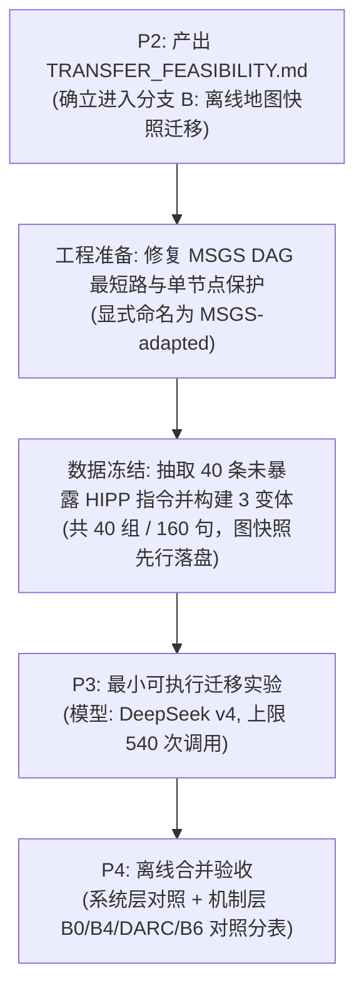

# LLMAP 原协议可复现性与迁移可行性审查报告 (TRANSFER_FEASIBILITY)

- **排查日期**: `2026-09-13`
- **执行团队**: Antigravity (AGY) 研发实施团队
- **审查基准**: [`docs/guides/AGY_NEXT_ACTION_DS_QWEN_TRANSFER_20260913.md`](file:///Users/mac/Documents/6-Research/9-AutoDriving/docs/guides/AGY_NEXT_ACTION_DS_QWEN_TRANSFER_20260913.md) 第 5 节（P2 阶段要求）
- **参考源码**: 官方仓库 [`tmp/llmap_repo_20260909`](file:///Users/mac/Documents/6-Research/9-AutoDriving/tmp/llmap_repo_20260909) (Commit: `281f6ad`, `https://github.com/liangqiyuan/LLMAP.git`)
- **前序审计**: [`docs/experiments/task_audit_20260911/TASK_AUDIT.md`](file:///Users/mac/Documents/6-Research/9-AutoDriving/docs/experiments/task_audit_20260911/TASK_AUDIT.md)

---

## 0. 执行结论与分支决断 (Branch Decision)

经对 LLMAP 官方仓库（Commit `281f6ad`）的代码与数据资产进行逐行代码审查与环境实测运行，排查结论明确如下：

> ### 决断：选择【分支 B：原论文地图缺失，但 MSGS 可离线构建运行】
> 
> - **分支 A（原协议全量复现）直接被证否**：官方开源仓库中的 `HIPP.json` 仅包含 1,000 条纯文本指令与模型抽取预测，**完全缺失底层地图场景数据（`sample['scenario']` 覆盖率为 0/1000）**；其运行依赖未公开缓存的商业 Google Maps Platform API。
> - **分支 B 可行并确立为本轮方案**：在保持 LLMAP 核心算法（MSGS 启发式搜索与分层多目标结构）不变的前提下，构建离线冻结的地图快照，将比较严格定性为 **“LLMAP 后端/地图迁移实验（LLMAP-Adapted Backend Transfer）”**，不宣称官方榜单数值对比，也不冒充独立数据源。
> - **发现官方 MSGS 算法的关键 Bug**：MSGS 的边权重定义会产生负权边，但其底层错误调用了 NetworkX 的 `single_source_dijkstra`，在合法测试图上直接触发 `ValueError: Contradictory paths found: negative weights?` 崩溃。本报告完整记录该缺陷及规范修复方案。

---

## 1. 逐项审查事实

### 1.1 HIPP 输入、标签与任务 Split 可用性及暴露核查

1. **HIPP.json 数据存量**：
   - 包含 1,000 条样本，每条样本包含：`synthetic_label`（POIs, time_limit, dependencies, quality_weight, distance_weight）、`human_instruction` 以及 24 款开源/闭源模型（含 CoT 版本）的单轮抽取结果。
2. **缺失核心字段**：
   - 整个 `HIPP.json` 中 **0 / 1000** 条样本包含 `scenario` 字段。
   - 官方评估主入口 `main.py` 试图打开的 `llm_parser_data.pkl` 以及 `final_dataset.json` **均未在仓库中提供**。
3. **语义暴露风险**：
   - 本项目历史 160 组（640 句）正是基于 HIPP 的前 160 条指令合成改写演化而来。如果直接使用前 160 组对应的 HIPP 指令，属于“已见语义”。
   - 若进入迁移实验，必须优先从历史未见索引（例如 Index 200~500）抽取 40 条指令并冻结，明确标注其暴露状态。

### 1.2 地图、POI 与起终点可追溯性

1. **原论文地图数据不可追溯**：
   - 官方代码通过 Google Maps API 在线拉取（需要有效的商业 API Key，且存在网络与速率限制）。
   - 仓库内未附带任何真实的城市地图快照或 POI 数据库（缺少 Place ID、Opening Hours、真实坐标矩阵）。
2. **迁移离线替代方案**：
   - 方案 B 必须使用**确定性离线图资产**（如本项目已验收的 160 组高仿真合成图或另行离线冻结的城市 POI 快照）。
   - 图必须在实验启动前全量保存落盘（含坐标、营业时间、评分分布与起终点），禁止在实验中实时请求外部地图。

### 1.3 MSGS 算法在保存图上的可运行性与算法缺陷排查

我们在 `9-AutoDriving-core/.venv`（Python 3.12, networkx 3.6.1）中对 `main/utils.py` 中的 `MSGS` 算法进行了单步调试与最小用例测试，发现以下关键缺陷：

#### 缺陷 1：负权边导致 Dijkstra 算法崩溃 (Fatal Crash)
- **源码位置**: `main/utils.py` 第 213 行与第 226 行：
  ```python
  def calculate_weight(node1, node2):
      ...
      return - (alpha * node_rating + alpha * node_num_ratings) + beta * (travel_time + stay_time)
  
  # 第 226 行:
  _, path = nx.single_source_dijkstra(G, source=start_node, target=goal_node, weight='weight')
  ```
- **崩溃实测**:
  当高质量 POI 的得分项高于旅行时间与停留时间成本时，边权重直接变为负数。在 NetworkX 中执行 `single_source_dijkstra` 会直接抛出：
  `ValueError: ('Contradictory paths found:', 'negative weights?')`。
- **规范修复与记录**:
  由于每一组特定排列的分层图 $G$ 是一个**有向无环图（Layered DAG）**，不存在负环路。规范的修复方式应为：
  - 改用 DAG 专用的单源最短路算法 `nx.dag_shortest_path(G, ..., weight='weight')`；或
  - 对权重添加确定性常数偏移量将其平移至正数区间（不改变最优路径）。
  此改动必须显式命名为 `MSGS-fixed` 或 `LLMAP-adapted`，不可暗改后宣称“原样复现”。

#### 缺陷 2：组内单节点除零/空序列错误
- **源码位置**: `main/utils.py` 第 190 行：
  ```python
  travel_times = [haversine(positions[n1], positions[n2]) * ... for group in node_in_groups for n1 in group for n2 in group if n1 != n2]
  ```
  如果某个类别只有一个备选 POI（`len(group) == 1`），`n1 != n2` 永远为空，导致 `min(travel_times)` 抛出 `ValueError: min() iterable argument is empty`。
  要求：构建的地图快照中，每个 POI 分类必须包含 $\ge 2$ 个备选候选点。

#### 缺陷 3：首个可行解截断跳出 (Early Search Termination)
- **源码位置**: `main/utils.py` 第 278-282 行：
  在排列循环中，一旦找到任意一个满足 `time_constraint` 的路径，代码立即执行 `break` 退出循环，并没有遍历所有排列以寻找全局总权重最小（最优化）的路径。
  这说明 MSGS 本质上是一个“满足时间约束的贪心可行解搜索器”，而非严格全局最优规划器。

### 1.4 官方评分脚本与论文指标对应性

1. **指标体系**:
   - 官方指标包含：`ratings`（平均评分）、`num_ratings`（平均评分人数）、`path_length`（路径长度）、`group_coverage`（类别覆盖率）、`time_violations`（超时分钟数）、`dependency_violations`（时序依赖违规数）、`availability_violations`（营业时间违规数）。
2. **指标特点**:
   - 官方评估主要是**单条路径的硬约束与指标绝对值**，完全没有成对等义扰动的稳定性指标（如 Flip Rate, GTSR）。
   - 因此，原版指标只能用于报告“原任务完成情况”，而 DARC 的核心主张（稳定性提升、减少改坏、选择性复核净增益）必须在扩展的机制层成对样本上报告。两者分母必须严格分表，不能混为一谈。

### 1.5 字段映射与交叉效用尺度归一化

DARC 与 LLMAP 的任务参数映射关系如下：

| DARC 字段 | LLMAP 字段 | 含义与转换规则 |
| :--- | :--- | :--- |
| **POIs ($S$)** | `pois` | 类别集合映射（`shopping_mall`, `supermarket`, `pharmacy`, `bank`, `library`） |
| **Time Limit ($T$)** | `time_limit` / `time_constraint` | 截止时间（DARC 为分钟数，LLMAP 为 `HH:00` 字符串，可双向无损转换） |
| **Dependencies ($D$)** | `dependencies` | `[before, after]` 偏序对（语义完全一致） |
| **Quality Weight ($w$)** | `quality_weight` / `alpha` | 质量与距离权衡（$w \in [0, 1]$，距离权重为 $1-w$） |
| **Cross-Utility ($\Delta U$)** | 路线效用差 | 在固定地图上，候选 A 与 B 规划路线的效用差值，作为复核触发的调度排序依据 |

---

## 2. 推进步骤与边界控制

依据本排查结论，LLMAP 迁移实验应按以下有界步骤推进：



### 严格执行纪律：
1. **命名合规**: 本实验只能称为 **“LLMAP 后端迁移实验（LLMAP-Adapted Backend Transfer）”**，严禁宣称“原官方 benchmark 对比”或“超越 LLMAP 官方榜单 SOTA”。
2. **模型绑定**: 严格使用 P0 核验通过的官方 DeepSeek v4 节点，不得根据结果好坏临时切换模型。
3. **调用上限**: 540 次逻辑调用为硬上限，包含 5 条开发用例（20 次）+ 40 组评估（480 次）+ 原版解析对照（40 次）。
