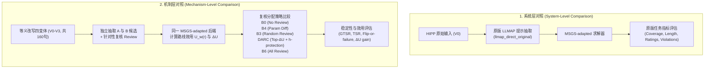

# LLMAP 迁移实验具体执行方案 (EXECUTION_PLAN)

- **编制日期**: `2026-09-13`
- **执行分支**: 【分支 B：离线冻结场景快照的 LLMAP 后端迁移实验 (LLMAP-Adapted Backend Transfer)】
- **指引依据**: [`docs/guides/AGY_NEXT_ACTION_DS_QWEN_TRANSFER_20260913.md`](file:///Users/mac/Documents/6-Research/9-AutoDriving/docs/guides/AGY_NEXT_ACTION_DS_QWEN_TRANSFER_20260913.md) 第 5、6 节
- **模型绑定**: 官方 DeepSeek v4 节点 (`https://api.deepseek.com`, `deepseek-v4-flash`)

---

## 1. 实验目标与科学边界

本实验旨在检验 **DARC 差异效用导向的复核分配机制（$\Delta U$ Gating）是否能够在异构规划后端（LLMAP 的 MSGS 启发式搜索环境）上稳定产生正向增益**。

### 科学边界声明：
1. **命名规范**：严格标注为 **“LLMAP 后端迁移实验（LLMAP-Adapted Backend Transfer）”**。
2. **非官方榜单 SOTA**：官方 HIPP 开源数据完全缺失真实场景（`sample['scenario']` 为空），官方依赖未公开的 Google Maps 在线商用数据。因此本实验使用高仿真确定性离线场景快照，不宣称超越官方榜单数值，不冒充独立数据源。
3. **算法修复透明**：官方 MSGS 存在负权边触发 NetworkX Dijkstra 崩溃问题（`ValueError: Contradictory paths found: negative weights?`），本项目修复并采用 DAG / Bellman-Ford 最短路算法，命名为 `MSGS-adapted`。

---

## 2. 样本与离线地图资产冻结

所有样本均严格从 `tmp/llmap_repo_20260909/dataset/HIPP.json` 中**未暴露**的历史索引中按序截取，保证与历史 160 组完全正交（0 交集）。

| 数据子集 | 组数 | 句子数 | 源索引范围 | 地图场景快照 | 存储路径 |
| :--- | :---: | :---: | :--- | :--- | :--- |
| **开发集 (Dev)** | 5 | 20 | `[0, 1, 3, 8, 12]` | 5 张确定性快照 (5×10 POIs) | `9-AutoDriving-core/data/llmap_transfer/dev_5_*` |
| **评估集 (Eval)** | 40 | 160 | `[13, 14, 15, ..., 91]` (共40个未暴露索引) | 40 张确定性快照 (40×10 POIs) | `9-AutoDriving-core/data/llmap_transfer/eval_40_*` |

- **地图快照规格**：
  - 起终点：高精经纬度坐标（往返闭环）。
  - POIs：每图 10 个候选点（5 分类 × 每分类 2 个备选点，完全避免官方单节点除零/空序列错误）。
  - 属性： Place ID、分类、真实评分、评分人数、营业时间（`Monday: 9:00 AM – 9:00 PM`）、停留时长。

---

## 3. 两层对照设计

### 3.1 系统层对照
在 40 条原始指令（V0）上，对比：
- **LLMAP-Adapted Baseline**：使用 LLMAP 官方抽取 Prompt + MSGS-adapted 求解。
- **DARC Pipeline**：使用 DARC 抽取与复核分配 + MSGS-adapted 求解。
- 报告指标：`group_coverage`, `path_length_km`, `avg_rating`, `time_violations`, `dependency_violations`, `availability_violations`。

### 3.2 机制层对照
在全量 40 组 × 4 变体 = 160 句上，统一在 `MSGS-adapted` 求解器上共享候选缓存：
- 评估 B0、B3、B4、DARC、B6。
- 主终点：预算 $K = 10\%$（即 16 次复核），保护项 $h$ 全分母共享。
- 报告指标：全分母 TSR / GTSR、Flip rate、效用改善、坏改率与回退率。

---

## 4. 调用预算与硬上限控制

迁移实验总逻辑调用上限为 **540 次**（严格契合指引 6.2 节）：

| 环节 | 输入数量 | 单条逻辑调用 | 总逻辑调用 | 说明 |
| :--- | :---: | :---: | :---: | :--- |
| **Dev 健康检查** | 5 | 4 (A + B + Review + LLMAP) | 20 | 验证接口连通、落盘与求解 |
| **Eval 机制层** | 160 | 3 (A + B + Review) | 480 | 全分母候选与复核缓存 |
| **Eval 系统层原版** | 40 | 1 (LLMAP 原版提示) | 40 | 原版提示抽取对照 |
| **合计** | - | - | **540** | 严格锁定，无隐藏调用 |

---

## 5. 产物目录规范

实验产物归档于：
`9-AutoDriving-core/results/v4_1/next_action_20260913/transfer_branch_b_<timestamp>/`
包含：
1. `manifest.json`：环境、commit、去密钥配置与输入哈希。
2. `expected_ids.json`：160 条评估 ID 与 20 条开发 ID 完整清单。
3. `attempts/`：逐 HTTP 尝试的详细记录（含请求体、原始响应、响应时间、usage）。
4. `records/`：最终逐输入解析结果与候选对象。
5. `joint_metrics.json` 与 `joint_metrics.csv`：系统层与机制层完整对比表。
6. `replay_verification.log`：离线可重放审计日志。
